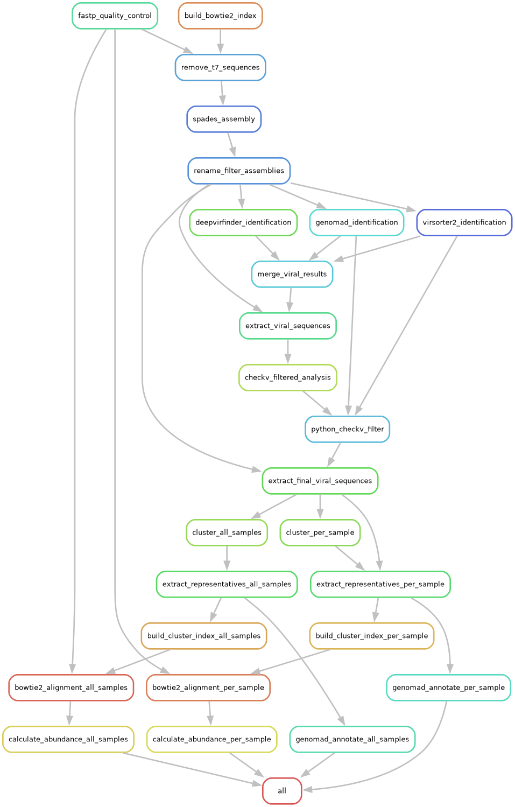

# Freshwater Conservation - Viral Metagenome Pipeline

A Snakemake pipeline for viral metagenome analysis from freshwater samples.

## Overview

This pipeline performs comprehensive viral identification, clustering, and abundance quantification from metagenomic sequencing data. The workflow includes quality control, host removal, assembly, viral identification using multiple tools, ANI-based clustering at both per-sample and cross-sample levels, and detailed abundance estimation with T7 phage reference integration.

## Pipeline Workflow



The workflow diagram shows the complete pipeline process:
1. Initial quality control (fastp) and host removal (T7)
2. Assembly with SPAdes
3. Parallel viral identification using three tools:
   - GeNomad
   - VirSorter2
   - DeepVirFinder
4. Merging and filtering viral predictions
5. Quality assessment with CheckV
6. Clustering and abundance estimation

## Pipeline Steps

### Steps 1-9: Quality Control and Viral Identification
1. Quality control with fastp
2. Host sequence removal (T7 phage) with Bowtie2
3. Metagenomic assembly with SPAdes
4. Sequence filtering and renaming with seqkit
5. Viral identification using:
   - GeNomad
   - VirSorter2
   - DeepVirFinder
   - CheckV

### Steps 10-14: Result Processing
10. Merge viral identification results from multiple tools
11. Extract viral contigs
12. Second CheckV analysis on filtered sequences
13. Quality filtering based on CheckV results
14. Extract final filtered viral sequences

### Steps 15-16: Clustering
15. Per-sample clustering using CheckV ANI-based method (95% ANI, 85% coverage)
16. All-samples combined clustering
17. Extract cluster representative sequences (corrected to use column 1)

### Steps 17-19: Abundance Quantification
18. Build combined Bowtie2 indices (T7 reference + cluster representatives)
19. Align quality-controlled reads (from fastp) to combined indices
20. Calculate abundance metrics (TPM, mean coverage, read counts) using CoverM
21. Taxonomic annotation with GeNomad

## Key Updates

### Combined Index Strategy
The pipeline now builds **combined Bowtie2 indices** that include:
- T7 phage reference genome
- Viral cluster representative sequences

This allows simultaneous mapping to both T7 control sequences and identified viral contigs for comprehensive abundance profiling.

### Corrected Cluster Representative Extraction
The `extract_representatives_per_sample` and `extract_representatives_all_samples` rules now correctly extract only cluster representatives (column 1) instead of all cluster members, ensuring one representative sequence per cluster.

### Quality-Controlled Input for Alignment
Bowtie2 alignment steps now use **fastp-processed reads** (which retain T7 sequences) rather than T7-removed reads, providing more accurate abundance estimates that account for T7 phage presence.

## Requirements

### Software Dependencies
- Snakemake (≥7.0)
- Conda/Mamba

### Required Databases
All required databases are provided in a single package through Zenodo [](https://doi.org/10.5281/zenodo.16737615):
- CheckV database (v1.5)
- GeNomad database
- T7 reference genome
- Pre-built indices and supporting files

> **Note**: The complete database package (3.2GB) must be downloaded and placed in the `./database` directory before running the pipeline. See the installation section for details.

### Required Tools (installed via conda)
- fastp
- Bowtie2
- SPAdes
- seqkit
- CheckV
- GeNomad
- VirSorter2
- DeepVirFinder
- CoverM
- BLAST+
- samtools

## Installation

1. Clone the repository:
```bash
git clone https://github.com/yourusername/sluge_phage_Extraction_snakemake.git
cd sluge_phage_Extraction_snakemake
```

2. Create conda environments:
```bash
# Create all required conda environments
for env in envs/*.yaml; do
    conda env create -f $env
done
```

3. Download and set up the required databases:
```bash
# Create database directory
mkdir -p database

# Download the database package from Zenodo
wget https://zenodo.org/records/16737615/files/database.zip

# Extract the database files to the correct location
unzip database.zip -d database/
```

The database package includes:
- CheckV database (v1.5)
- GeNomad database
- T7 reference genome
- All necessary index files

[](https://doi.org/10.5281/zenodo.16737615)

> **Important**: The database files (3.2GB) must be placed in the `./database` directory for the pipeline to work correctly. The directory structure should match what's provided in the Zenodo archive.

## Usage

### Quick Start

1. Configure your samples in `profiles/config.yaml`:
```yaml
samples:
  - day0_2
  - day14_4_1
  - day3_20_2
  # Add more samples as needed
```

2. Place your input files in the `input/` directory following the naming convention:
```
input/
  day0_2.R1.raw.fastq.gz
  day0_2.R2.raw.fastq.gz
  day14_4_1.R1.raw.fastq.gz
  day14_4_1.R2.raw.fastq.gz
```

3. Run the pipeline:
```bash
# Dry run to check workflow
snakemake --snakefile Snakefile --dry-run

# Run the pipeline using multiple cores
snakemake --snakefile Snakefile --cores 8 --use-conda

# Run on a SLURM cluster
snakemake --snakefile Snakefile --profile profiles/slurm
```

### Running Partial Workflow

If you have pre-existing results and want to run only the clustering and abundance steps:

```bash
# Use the partial workflow (Snakefile_runed.smk)
# This starts from cluster representative extraction
snakemake --snakefile Snakefile_runed.smk --cores 8 --use-conda
```

## Output Structure

```
results/
├── 1_fastp/                    # Quality control results
├── 2_T7_removal/               # Host removal results
├── 3_spades_result/            # Assembly results
├── 4_rename_assembly/          # Filtered assemblies (≥5kb)
├── 5_genomad/                  # GeNomad results
├── 6_virsorter2/               # VirSorter2 results
├── 7_deepvirfinder/            # DeepVirFinder results
├── 8_python_merge_filter/      # Merged viral predictions
├── 9_checkv/                   # CheckV quality assessment
├── 10_cluster/                 # Viral clustering results
│   ├── 1_filtered_seq/         # Filtered viral sequences
│   ├── 2_combined/             # Combined sequences for all-samples clustering
│   ├── 3_clustered/            # Clustering results
│   │   ├── per_sample/         # Per-sample clustering (ANI, BLAST, cluster assignments)
│   │   └── all_samples*        # All-samples clustering files
│   ├── 4_cluster_fasta/        # Cluster representative sequences
│   └── 5_bowtie_index/         # Combined Bowtie2 indices (T7 + representatives)
├── 11_bowtie2/                 # Abundance estimation
│   ├── per_sample/             # Per-sample alignment and abundance (BAM, TPM, mean, count)
│   └── all_samples/            # All-samples alignment and abundance (BAM, TPM, mean, count)
└── 12_taxonomy/                # Taxonomic annotation
    └── genomad/                # GeNomad annotation results
        ├── per_sample/         # Per-sample annotations
        └── all_samples/        # All-samples annotations
```

## Configuration

Edit `profiles/config.yaml` to configure:

### Sample Configuration
```yaml
samples:
  - day0_2
  - day14_4_1
  - day3_20_2
  - day3_4_2
  - day7_4_1
  - day7_4_2
```

### Resource Allocation
- SLURM account and partition settings
- Memory and CPU requirements per tool
- Runtime limits

Example:
```yaml
runtime: 2880  # minutes
slurm_account: "research-ceg-wm"
regular_memory: 3900  # MB per CPU
regular_partition: "compute"
```

### Tool Parameters

#### Clustering Parameters
```yaml
# ANI-based clustering thresholds
min_ani: 95      # Minimum ANI for clustering
min_tcov: 85     # Minimum target coverage
min_qcov: 0      # Minimum query coverage
```

#### Alignment Parameters
```yaml
# CoverM abundance calculation
min_read_percent_identity: 95
min_read_aligned_percent: 90
```

#### Quality Filtering
```yaml
seqkit:
  min_length: 5000  # Minimum contig length
```

### Database Paths
```yaml
bowtie2_index: "database/T7_ref/GCF_000844825.1_ViralProj14460_genomic.fna"
checkv_db: "database/checkv-db-v1.5/"
genomad_db: "/path/to/genomad_db"
```

## Scripts

### `script/checkv/anicalc.py`
Calculate Average Nucleotide Identity (ANI) from BLAST results. Part of CheckV clustering workflow.

### `script/checkv/aniclust.py`
Cluster sequences based on ANI values using single-linkage clustering with customizable thresholds (default: 95% ANI, 85% coverage).

### `script/merge_3_viral_identification.py`
Merge and consolidate results from three viral identification tools (DeepVirFinder, GeNomad, VirSorter2). Implements consensus-based viral contig identification.

### `script/checkv_sec_filter.py`
Filter viral sequences based on CheckV quality metrics and tool predictions. Applies quality thresholds to ensure high-confidence viral contigs.

## Key Features

- **Combined T7+Viral Index**: Integrates T7 phage reference with cluster representatives for comprehensive abundance profiling
- **Dual Clustering Strategy**: Performs both per-sample and all-samples clustering for comprehensive analysis
- **Multi-tool Validation**: Integrates results from three independent viral identification tools
- **Automated Abundance Quantification**: Calculates TPM, mean coverage, and read counts for all clusters
- **Corrected Representative Selection**: Accurately extracts one representative per cluster
- **SLURM Integration**: Optimized for high-performance computing clusters
- **Modular Design**: Easy to customize and extend individual steps
- **Flexible Workflows**: Full pipeline (Snakefile) or partial workflow (Snakefile_runed.smk)

## Troubleshooting

### Common Issues

**Issue**: `MissingInputException` for cluster representative files
- **Solution**: Ensure upstream clustering rules are uncommented and have completed successfully

**Issue**: Empty abundance output files
- **Solution**: Check that Bowtie2 index was built correctly with both T7 and cluster representatives

**Issue**: `cut -f 2` extracting wrong sequences
- **Solution**: Use `cut -f 1` to extract cluster representatives (column 1), not all members (column 2)

**Issue**: SLURM job failures
- **Solution**: Adjust memory and runtime parameters in `profiles/config.yaml`

## Citations

If you use this pipeline, please cite the following tools:

- **Snakemake**: Köster, J., & Rahmann, S. (2012). Snakemake—a scalable bioinformatics workflow engine. Bioinformatics, 28(19), 2520-2522.
- **CheckV**: Nayfach, S., et al. (2021). CheckV assesses the quality and completeness of metagenome-assembled viral genomes. Nature Biotechnology, 39(5), 578-585.
- **GeNomad**: Camargo, A.P., et al. (2023). Identification of mobile genetic elements with geNomad. Nature Biotechnology.
- **VirSorter2**: Guo, J., et al. (2021). VirSorter2: a multi-classifier, expert-guided approach to detect diverse DNA and RNA viruses. Microbiome, 9(1), 1-13.
- **DeepVirFinder**: Ren, J., et al. (2020). Identifying viruses from metagenomic data using deep learning. Quantitative Biology, 8(1), 64-77.
- **CoverM**: Woodcroft, B. (2022). CoverM: Read coverage calculator. https://github.com/wwood/CoverM
- **SPAdes**: Nurk, S., et al. (2017). metaSPAdes: a new versatile metagenomic assembler. Genome Research, 27(5), 824-834.
- **fastp**: Chen, S., et al. (2018). fastp: an ultra-fast all-in-one FASTQ preprocessor. Bioinformatics, 34(17), i884-i890.

## Version History

### v1.1 (Current)
- Added combined T7+cluster representative index building
- Corrected cluster representative extraction (column 1 instead of column 2)
- Updated alignment to use fastp-processed reads
- Added GeNomad taxonomic annotation
- Improved documentation and troubleshooting guide

### v1.0
- Initial release with complete viral identification pipeline
- Dual clustering strategy (per-sample and all-samples)
- Integrated abundance quantification

## License

This pipeline is provided as-is for research purposes.

## Contact

For questions or issues, please open an issue on GitHub or contact the repository maintainers.

## Acknowledgments

This pipeline was developed for freshwater viral conservation research. We thank the developers of all the integrated tools for making their software available to the research community.
